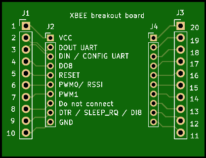

# XBeeBreakoutBoard - KiCAD files
A breakout board adapter from xbee 2,0mm to 2,54mm pin pitch

This board is used, to put a xbee on a breadboard(you need 2 breadbords) or a perf board.

Size of this board is 43,18mmx33,02mm

## Front

## Back

